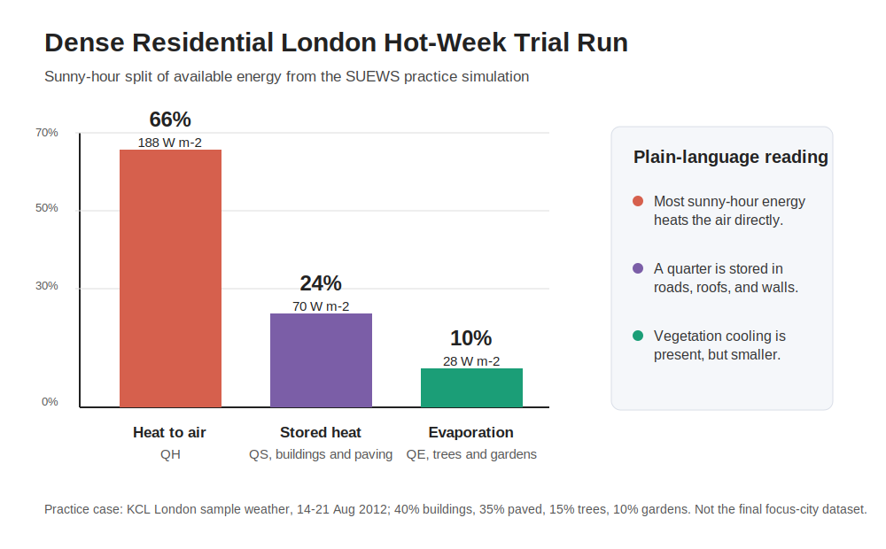

# SUEWS Hackathon Trial Run

## Motivating Question

**Which neighbourhoods in the focus city become most heat-risk exposed under a +3 C hotter-future stress test, and where do social vulnerabilities make that heat most dangerous?**

This is my trial run for the SUEWS Community Hackathon. The real focus-city dataset is released on the day, so this page does **not** claim to answer the final question yet. Instead, it rehearses the workflow I want to use: set up a neighbourhood, run SUEWS for a hot period, interpret the surface energy balance, and explain what would need to change when the actual city and social-vulnerability data are available.

## Practice Case

For this rehearsal, I used a simplified dense residential neighbourhood in London:

| Input | Practice value |
| --- | ---: |
| Buildings | 40% |
| Average building height | 12 m |
| Paved streets, pavements, and car parks | 35% |
| Street trees | 15% |
| Small gardens / grass | 10% |
| Open water | 0% |

The run uses the bundled KCL London sample weather, clipped to a hot summer week: **14-21 August 2012**. This gives me a realistic practice workflow, but it is still a sample case rather than the final hackathon city.

## Method

1. I used the SUEWS tooling to initialise a simple urban case.
2. I changed the land cover to match the dense residential neighbourhood above.
3. I changed the average building height to 12 m.
4. I selected the hottest 7-day period in the bundled KCL 2012 sample weather.
5. I ran SUEWS and checked that the output had 168 hourly records, no missing values in the main heat-flow variables, and no validation errors.
6. I interpreted the surface energy balance in plain language.

For the real hackathon question, I would repeat this process across the focus-city neighbourhoods, then compare the current climate run against the provided **+2 to +3 C hotter-future stress test**. The heat-hazard outputs would then be combined with the social-vulnerability indicators released on the day.

## Findings From The Trial Run

During sunny hours, the model estimated about **285 W/m2** of available energy from net radiation plus human-made heat. In this dense residential setup, that energy mostly went into heating the air and built surfaces:

| Destination of sunny-hour energy | Share | Mean heat flow |
| --- | ---: | ---: |
| Heating the air directly, QH | 66% | 188 W/m2 |
| Stored in buildings and paving, QS | 24% | 70 W/m2 |
| Evaporation and plant cooling, QE | 10% | 28 W/m2 |

The key message is that this neighbourhood behaves like a heat-retaining urban surface. With 75% of the area built or paved, most daytime energy goes into warming the air or being stored in roads, roofs, walls, and other hard materials. The trees and gardens do provide cooling through evaporation, but their share is much smaller in this setup.

The surface temperature peaked at about **37.7 C**, while the modelled near-surface air temperature peaked at about **30.7 C**. At night, stored heat was released back from the urban fabric, which is one reason dense neighbourhoods can stay warm after sunset.

## How This Connects To The Hackathon Question

This trial does not yet rank neighbourhoods by heat risk. To answer the motivating question on the day, I would ask the AI assistant and SUEWS agent to do three linked steps:

1. **Run the heat hazard model** for each focus-city neighbourhood under the current hot-season weather.
2. **Run the hotter-future stress test** using the provided +2 to +3 C forcing.
3. **Combine the hazard outputs with vulnerability data** to identify where heat is both physically intense and socially dangerous.

The strongest final answer would not just say "where it gets hottest". It would separate:

- neighbourhoods where the physical heat hazard is high;
- neighbourhoods where people may be more vulnerable;
- neighbourhoods where both overlap, creating the most urgent risk.

Possible heat-hazard measures include dangerous-heat hours, high night-time temperature, heat-storage strength, and the increase in these measures under the hotter-future stress test. The exact social-risk indicator should follow the framework and data released by the organisers.

## Honest Caveats

This page is a rehearsal, not the final judged analysis.

| What is real in this trial | What is still missing |
| --- | --- |
| SUEWS ran successfully end to end. | The focus-city dataset is not included here. |
| The land-cover setup was changed from the sample. | The +3 C hotter-future forcing has not been run yet. |
| The figure and results come from actual SUEWS output. | No social-vulnerability indicator has been calculated yet. |
| The workflow is reproducible from this repository. | The London sample should not be treated as the hackathon result. |

The SUEWS diagnostic tool also kept one warning about an energy-balance closure ratio. The direct component arithmetic for the plotted heat flows was effectively closed, but I would still flag this warning to a table lead rather than ignore it.

## How This Trial Maps To The Judging Criteria

| Criterion | What this trial already demonstrates | What I still need for the real submission |
| --- | --- | --- |
| Scientific soundness | A reproducible SUEWS run, changed land cover, stated assumptions, validation checks, output figure, and SUEWS citation. | Replace the London sample with the focus-city dataset, run all relevant neighbourhoods, and resolve or explain any diagnostic warnings with expert support. |
| Policy relevance and honest bridging | The page separates physical heat hazard from social vulnerability and explains that the hazard-to-risk bridge is not complete yet. | Apply the provided UNDRR-style vulnerability or risk indicator and say clearly where the indicator is strong or uncertain. |
| Professional contribution | This page is designed as a forum-ready practice post: a transparent trial workflow with caveats and questions for feedback. | Post it to the SUEWS community forum before the event and use the feedback to improve the final workflow. |
| Presentation quality | The page has a single motivating question, a short method, one clear figure, findings, and caveats. | For the final entry, show ranked focus-city neighbourhoods and make the main takeaway visible within the first screen. |
| Innovation and AI collaboration | The workflow uses the AI assistant to set up, run, diagnose, visualise, and interpret a SUEWS case in plain language. | Export the AI transcript and keep the best prompts, checks, failures, and corrections as evidence of the collaboration. |

## What I Would Ask On The Day

> Using the focus-city dataset, run SUEWS for every neighbourhood for the baseline hot-season weather and the hotter-future +3 C stress test. Summarise which neighbourhoods have the largest increase in dangerous heat hours and night-time heat retention. Then combine those heat-hazard outputs with the provided social-vulnerability indicators, and rank the neighbourhoods where physical heat and social vulnerability overlap most strongly. Explain the assumptions and where the hazard-to-risk bridge is uncertain.

## SUEWS Citation

This trial uses SUEWS/SuPy `2026.6.5`. Any final submission should cite the current SUEWS software release and the core SUEWS papers:

- Jarvi, L., Grimmond, C.S.B. and Christen, A. (2011). The Surface Urban Energy and Water Balance Scheme (SUEWS): Evaluation in Los Angeles and Vancouver. *Journal of Hydrology*, 411(3-4), 219-237.
- Ward, H.C., Kotthaus, S., Jarvi, L. and Grimmond, C.S.B. (2016). Surface Urban Energy and Water Balance Scheme (SUEWS): Development and evaluation at two UK sites. *Urban Climate*, 18, 1-32.
